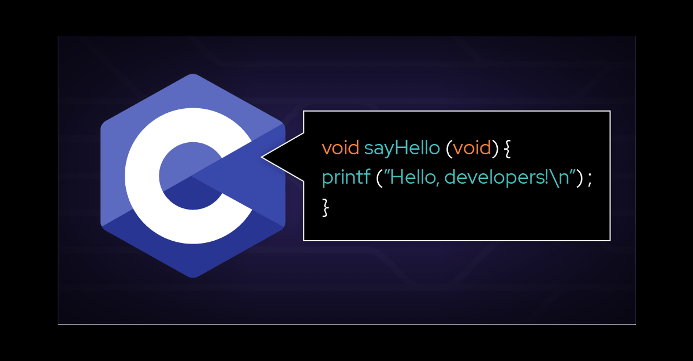

# PRINTF

## Concepts
In this project, you will explore and apply the following concepts:

- Group Projects
- Pair Programming - How To
- Flowcharts
- Technical Writing
- Background Context
- Implementing your own printf function

## Contributors
- osm-pixle
- EDDAHBIABDELHAMID

## Resources
1. Technical Writing
   - https://intranet.alxswe.com/concepts/225
2. Secrets of printf
   - https://intranet.alxswe.com/rltoken/7Vw7aUWgwC7JYUrqI4bh4Q
3. Group Projects concept page (Read this carefully)
   - https://intranet.alxswe.com/concepts/111
4. Flowcharts concept page
   - https://intranet.alxswe.com/concepts/130

## Requirements

1. General

- Allowed editors: vi, vim, emacs
- Compilation: Ubuntu 20.04 LTS using gcc with options -Wall -Werror -Wextra -pedantic -std=gnu89
- Files should end with a new line
- A mandatory README.md file at the root of the project folder
- Code should follow the Betty style (checked using betty-style.pl and betty-doc.pl)
- Prohibited use of global variables
- Maximum of 5 functions per file
- Prototypes of all functions in the main.h header file
- Push your header file and make sure it's include guarded

2. GitHub

- One project repository per group
- Other members shouldn't fork or clone the project to ensure only one repository exists

## Compilation

- Your code will be compiled with:

bash
 $ gcc -Wall -Werror -Wextra -pedantic -std=gnu89 *.c

## Main File Inclusion

Your main header file (main.h) will be included in the main files. Use:

 #include "main.h"

## Authorized Functions and Macros

- write (man 2 write)
- malloc (man 3 malloc)
- free (man 3 free)
- va_start (man 3 va_start)
- va_end (man 3 va_end)
- va_copy (man 3 va_copy)
- va_arg (man 3 va_arg)

